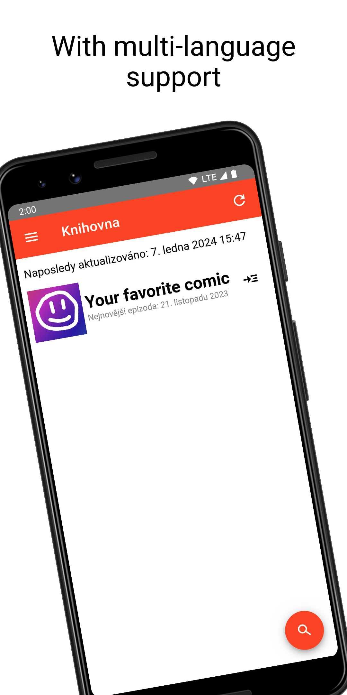

<h1 align="center">OpenTapasReader</h1>

    OpenTapasReader is an open-source Android client for viewing <a href="https://tapas.io/">Tapas.io</a> comics.  
    Built with <a href="https://svelte.dev/">Svelte</a> and <a href="https://capacitorjs.com/">Capacitor</a>.  
    

## Notice

I do not condone piracy in any way, and this application does not allow you to pirate content. Only use it at your own risk and for legitimate use. If you find the application to be infringing copyright or violating the Terms of Service, please do not hesitate to contact me either through a [GitHub issue](https://github.com/TriLinder/OpenTapasReader/issues/new) or by email (opentapasreader.fifty411@aleeas.com) and I will gladly take the application down. I always recommend using the [official Tapas.io application](https://play.google.com/store/apps/details?id=com.tapastic).

## Features

- Local comic library
- Viewing comics and comic episodes
- Downloading episodes for offline use
- Viewing comments
- English and Czech language support (contributions are welcome)

## Installation

- Download and install an `.apk` file from the [Releases](https://github.com/TriLinder/OpenTapasReader/releases/latest) page
- Install the app and keep it updated through [F-Droid](https://f-droid.org/en/packages/com.github.trilinder.tapasclient/)
- Alternatively, you can build the app from source (see below)

## Screenshots

  
   
  
  

## Building

Prerequisites: Android Studio and Node.js

1. Clone the repository
2. Run `npm install` in the directory to install project dependencies
3. Run `npm run dev` to debug the application in a web browser (You must temporarily [disable CORS protection](https://addons.mozilla.org/en-US/firefox/addon/cors-everywhere/) for the application to work properly. **Please make sure to enable it again as soon as possible.**)
4. Run `npm run build && npx cap sync && npx cap open android` to build the web files and open the application in Android studio
5. Build the application in Android Studio